<p align="center">
  
</p>

<p align="center">
  
</p>

### Stack

|   |   |
|---|---|
| **languages** | typescript · python · javascript · sql |
| **frontend**  | next.js · react · tailwind · framer motion |
| **backend**   | fastapi · node · express · trpc |
| **data**      | postgres · supabase · redis · pinecone |
| **ai / ml**   | openai · embeddings · rag · mcp · agents |
| **infra**     | aws · docker · terraform · github actions |

---

### Building

**OpenCodeIntel**
The missing context layer for AI-assisted development. Semantic code search that makes Cursor, Claude, and Windsurf actually understand a codebase.
`87.5% Hit@1` · `712 commits` · `MCP-native`
[opencodeintel.com](https://opencodeintel.com) · [source](https://github.com/OpenCodeIntel/opencodeintel)

<p align="center">
  
</p>

**Portfolio OS**
A full operating system experience, in a browser tab. Built from scratch.
`Next.js 15` · `TypeScript` · `Framer Motion`
[Portfolio](https://devanshuchicholikar.com)

---

### Currently shipping

<!-- AUTO:START -->
**2026-06-12** · fix: normalize indexed repo paths in eval runner, calibrate baseline
<!-- AUTO:END -->

---

### Now

Spending the next six weeks shipping cycle 2 of OpenCodeIntel: the education loop, end to end. Can a developer tool teach better prompting using your own codebase as the curriculum? Either it works or I learn what doesn't. Either way, those lessons come with me to whichever team I join.

---

### Activity

<p align="center">
  
</p>

---

### The team I'm looking for

```
small teams that ship before it's perfect.
hard technical problems over big-company comfort.
all-in on ai, not ai-curious.
people who care about craft, not titles.
```

---

### Background

Graduate TA for Cloud Computing and Networks at Northeastern University, under Prof. Tejas Parikh. Two years before grad school at Jaksh Enterprise: production MERN, AWS migration, dropped API latency by 65%.

Open to full-time SWE roles, May 2026. F1 to OPT to STEM OPT, three years of US work authorization.

<details>
<summary><b>Why I'm all-in on AI</b></summary>

<br/>

I have been writing code since I was a teenager. The last two years changed what that means. AI tools went from gimmick to "actually helps me ship," and the gap between people who ship with AI and people who do not grew faster than anything I have seen in software.

So I went all in. I read the papers. I read the code. I built a product (OpenCodeIntel) on the bet that AI coding tools need a context layer they do not have yet. I am finding out if I am right.

The next decade of software is going to be written by people who treat AI like infrastructure, not a feature. I want to be one of them. And I want to do it on a team that is already there.

Either we ship something that matters, or we learn fast and try again.

</details>

[devanshuchicholikar.com](https://devanshuchicholikar.com) · [linkedin](https://linkedin.com/in/devanshu-chicholikar) · [email](mailto:chicholikar.d@northeastern.edu)
