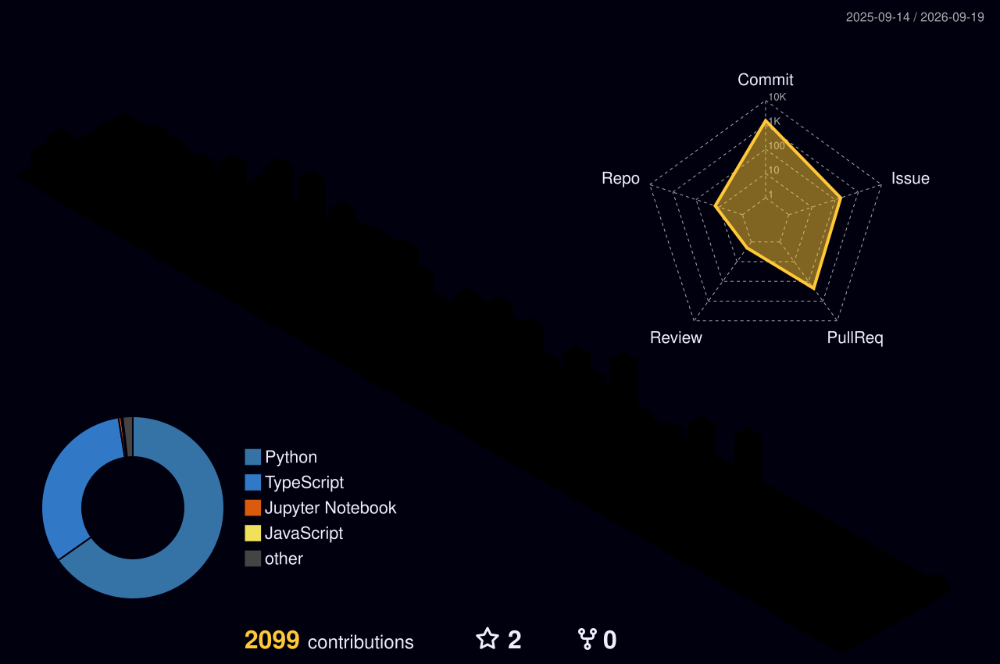

  

### Work

**OpenCodeIntel**
The missing context layer for AI-assisted development. Semantic code search that makes Cursor, Claude, and Windsurf actually understand a codebase.
`87.5% Hit@1` · `688 commits` · `MCP-native`
[opencodeintel.com](https://opencodeintel.com) · [source](https://github.com/OpenCodeIntel/opencodeintel)

**Portfolio OS**
A full operating system experience, in a browser tab. Built from scratch.
`Next.js 15` · `TypeScript` · `Framer Motion`
[devanshuchicholikar.com](https://devanshuchicholikar.com)

---

### Currently shipping

<!-- AUTO:START -->
**2026-04-24** · docs: clean pass -- remove em dashes, professional prose throughout
<!-- AUTO:END -->

---

### Now

Cycle 2 of OpenCodeIntel is the education loop, end to end. Can a developer tool teach better prompting using your own codebase as the curriculum? Six weeks of validation work, ending June 22. I'm taking the lessons into whichever team I join next.

---

### Activity

  

---

### Background

Graduate TA for Cloud Computing and Networks at Northeastern University, under Prof. Tejas Parikh.
Open to full-time SWE roles, May 2026. F1 to OPT to STEM OPT, three years of US work authorization.

[devanshuchicholikar.com](https://devanshuchicholikar.com) · [linkedin](https://linkedin.com/in/devanshu-chicholikar) · [email](mailto:chicholikar.d@northeastern.edu)
