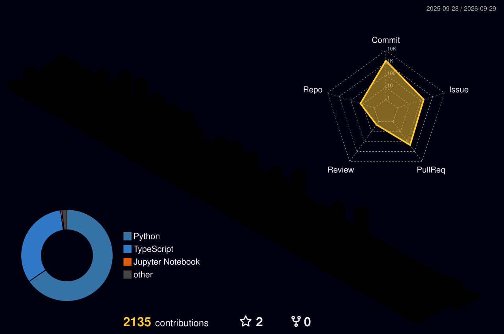

<p align="center">
  
</p>

<p align="center">
  
</p>

I'm an AI engineer in Boston. I ship AI systems to production end to end: MCP servers, RAG with retrieval evals, LLM-as-a-judge eval harnesses and voice agents, plus the full-stack, infra and design work around them. MS in Software Engineering Systems from Northeastern University (2026). Open to AI Engineer and Forward Deployed Engineer roles anywhere in the US.

### Stack

|   |   |
|---|---|
| **ai**        | mcp (model context protocol) · rag · evals · llm-as-a-judge · voice agents (retell, pipecat) · claude · openai · embeddings · reranking |
| **languages** | typescript · python · java · javascript · go · sql |
| **frontend**  | next.js · react · tailwind · framer motion |
| **backend**   | fastapi · node · spring boot · express · websockets |
| **data**      | postgres · supabase · redis · pinecone · duckdb |
| **infra**     | aws · gcp · docker · terraform · kubernetes · github actions · railway · vercel |

---

### Building

**OpenCodeIntel**
A code-search platform (web app, API and MCP server) that gives AI coding agents real context on a codebase. Hybrid BM25 + vector retrieval with reranking and tree-sitter AST chunking.
`94% Hit@1 on 14 codebases (research eval)` · `12 MCP tools` · `141 merged PRs` · `717 commits` · `p50 242ms cached`
[opencodeintel.com](https://opencodeintel.com) · [source](https://github.com/OpenCodeIntel/opencodeintel)

<p align="center">
  
</p>

**Overhear**
An AI QA analyst for voice agents. It grades every call a Retell healthcare-scheduling agent takes against the clinic's real database: code decides the facts, and an LLM judge scores tone and safety.
`39-call golden dataset` · `23/23 planted failures caught` · `macro-F1 0.89` · `built in 7 days`
[source](https://github.com/DevanshuNEU/overhear)

**CallBudget**
Active-sensing pharmacy search. It predicts which pharmacy has a hard-to-find drug, calls the most likely one first through a voice agent, and learns from every call.
`calls-to-find 4.3 → 2.3` · `false "in stock" 10% → 0%` · `FastMCP server` · `Pipecat voice agent`
[walkthrough](https://www.loom.com/share/0231954a438c4b3ab011fd21f4f41bf2) · [source](https://github.com/DevanshuNEU/callbudget)

**Saar**
A Chrome extension that tracks Claude.ai token usage and cost in real time, entirely in the browser. Published on the Chrome Web Store.
`1,808 tests` · `Chrome MV3` · `no backend`
[getsaar.com](https://getsaar.com) · [source](https://github.com/OpenCodeIntel/lco)

**Portfolio OS**
A full operating system experience, in a browser tab. Built from scratch.
`Next.js 15` · `TypeScript` · `Framer Motion`
[devanshuchicholikar.com](https://www.devanshuchicholikar.com)

---

### Currently shipping

<!-- AUTO:START -->
**2026-10-09** · Saar · docs(store-listing): call inject.js a page-context script, not sandboxed
<!-- AUTO:END -->

---

### Now

Building a self-hosted Go broker that sits between AI agents and the platform APIs they call. Interviewing for AI Engineer and Forward Deployed Engineer roles.

---

### Activity

<p align="center">
  
</p>

---

### The team I'm looking for

```
small teams that ship before it's perfect.
hard technical problems over big-company comfort.
all-in on ai, not ai-curious.
people who care about craft, not titles.
```

---

### Background

Graduate Teaching Assistant for CSYE 6225 Network Structures and Cloud Computing at Northeastern University under Prof. Tejas Parikh (Sep 2025 to May 2026), teaching cloud best practices on AWS to 60+ graduate students. Before grad school, two years as a full-time software engineer at Jaksh Enterprise: a Java / Spring Boot quotation engine for 590+ products, with quote-page p95 latency cut 65%. Before that, a software engineering internship at Pitney Bowes.

Authorized to work in the US (F-1 OPT, STEM-eligible). Earlier work, 2020 to 2024: [github.com/Devanshuc](https://github.com/Devanshuc).

<details>
<summary><b>Why I'm all-in on AI</b></summary>

<br/>

I have been writing code since I was a teenager. The last two years changed what that means. AI tools went from gimmick to "actually helps me ship," and the gap between people who ship with AI and people who do not grew faster than anything I have seen in software.

So I went all in. I read the papers. I read the code. I built a product (OpenCodeIntel) on the bet that AI coding tools need a context layer they do not have yet. I am finding out if I am right.

The next decade of software is going to be written by people who treat AI like infrastructure, not a feature. I want to be one of them. And I want to do it on a team that is already there.

Either we ship something that matters, or we learn fast and try again.

</details>

[devanshuchicholikar.com](https://www.devanshuchicholikar.com) · [linkedin](https://www.linkedin.com/in/devanshuchicholikar) · [email](mailto:chicholikar.d@northeastern.edu)
