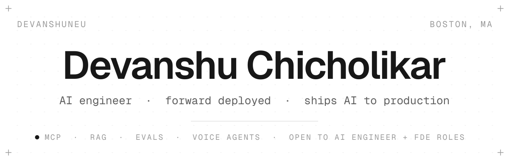
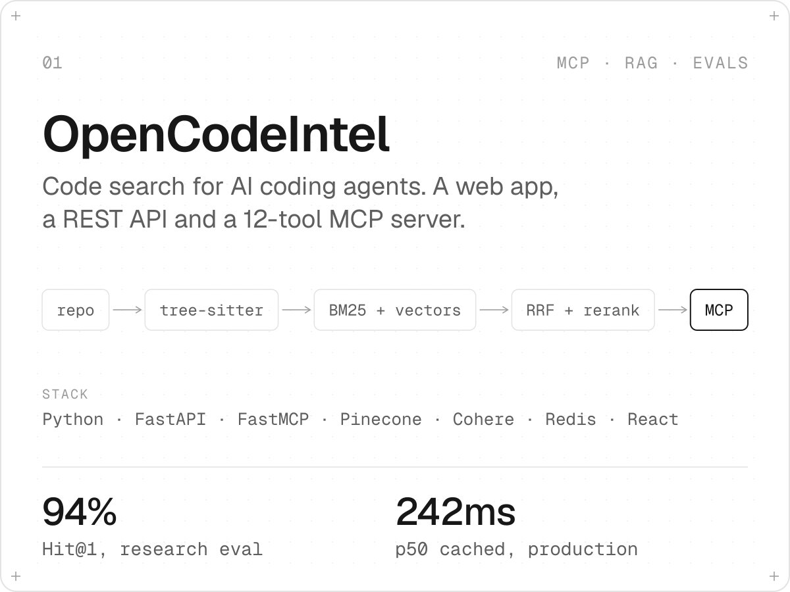
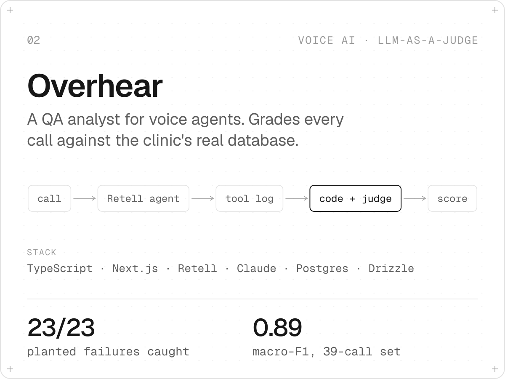
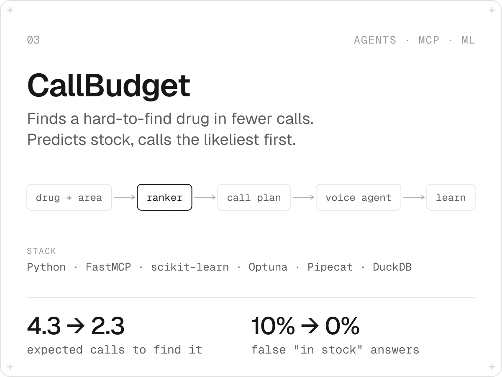
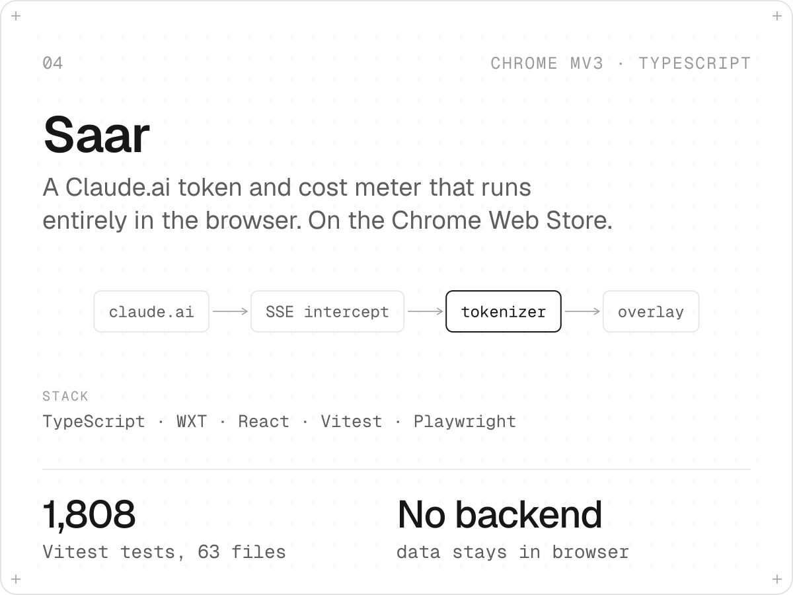
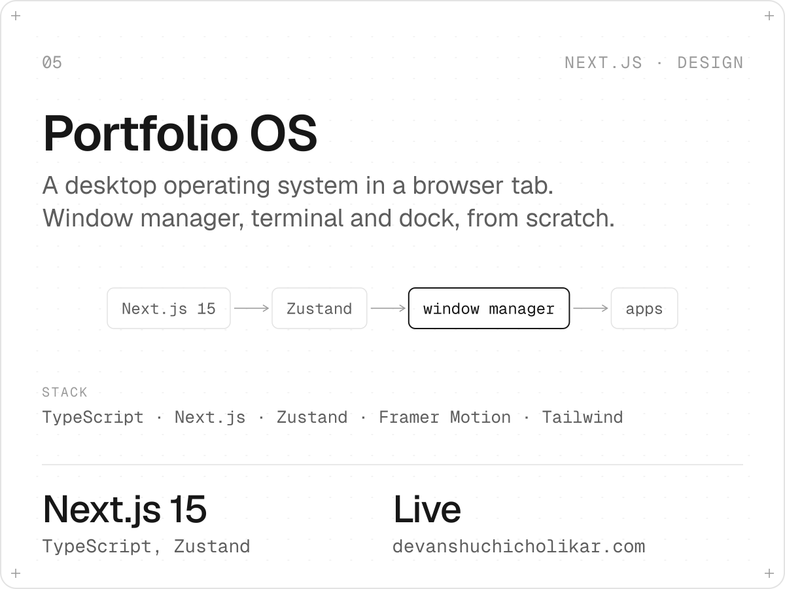
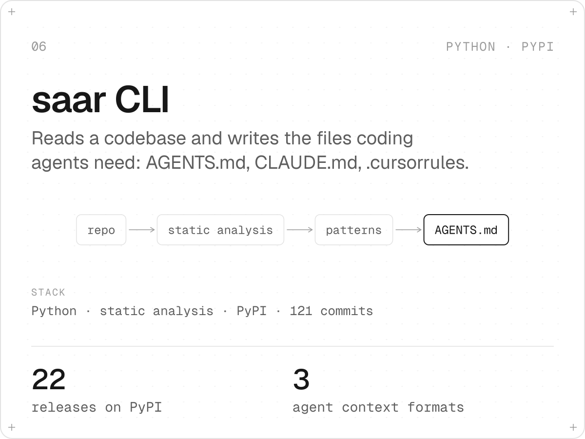
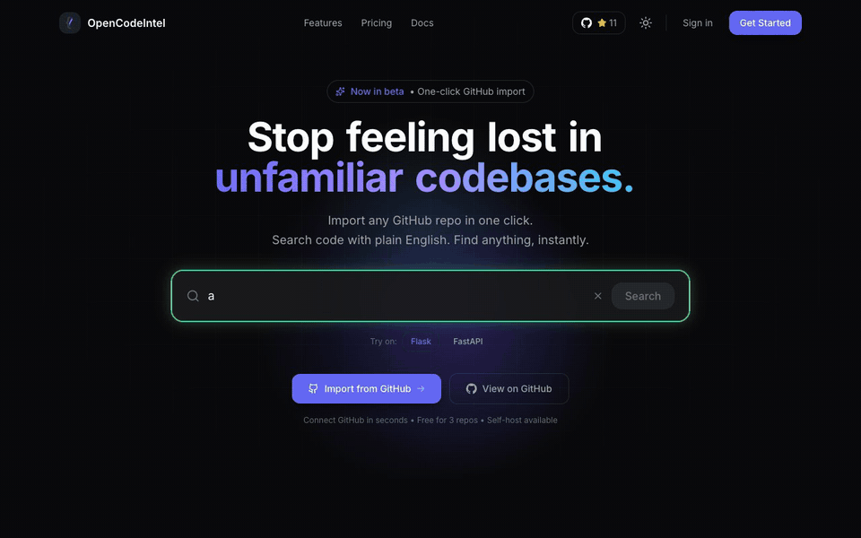
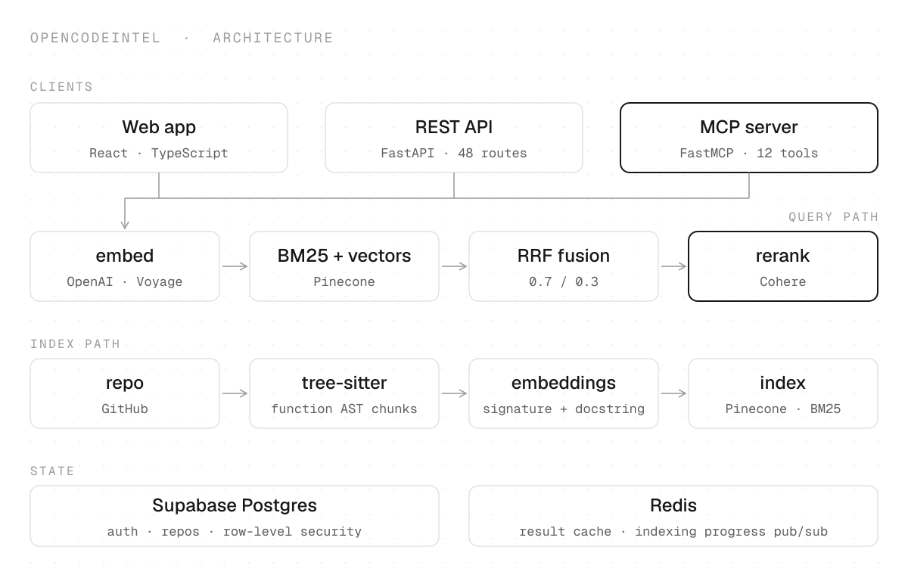

<picture>
  <source media="(prefers-color-scheme: dark)" srcset="./.github/assets/hero-dark.svg">
  
</picture>

I'm an AI engineer in Boston. I ship AI systems to production end to end: MCP servers, RAG with retrieval evals, LLM-as-a-judge eval harnesses and voice agents, plus the full-stack, infra and design work around them. MS in Software Engineering Systems, Northeastern University (2026). Open to AI Engineer and Forward Deployed Engineer roles anywhere in the US.

<samp><a href="https://www.devanshuchicholikar.com">portfolio</a> · <a href="https://opencodeintel.com">opencodeintel.com</a> · <a href="https://www.linkedin.com/in/devanshuchicholikar">linkedin</a> · <a href="mailto:chicholikar.d@northeastern.edu">email</a></samp>

### Selected work

<a href="https://github.com/OpenCodeIntel/opencodeintel"><picture><source media="(prefers-color-scheme: dark)" srcset="./.github/assets/card-opencodeintel-dark.svg"></picture></a>
<a href="https://github.com/DevanshuNEU/overhear"><picture><source media="(prefers-color-scheme: dark)" srcset="./.github/assets/card-overhear-dark.svg"></picture></a>

<a href="https://github.com/DevanshuNEU/callbudget"><picture><source media="(prefers-color-scheme: dark)" srcset="./.github/assets/card-callbudget-dark.svg"></picture></a>
<a href="https://github.com/OpenCodeIntel/lco"><picture><source media="(prefers-color-scheme: dark)" srcset="./.github/assets/card-saar-dark.svg"></picture></a>

<a href="https://github.com/DevanshuNEU/web-v2"><picture><source media="(prefers-color-scheme: dark)" srcset="./.github/assets/card-portfolio-os-dark.svg"></picture></a>
<a href="https://github.com/OpenCodeIntel/saar"><picture><source media="(prefers-color-scheme: dark)" srcset="./.github/assets/card-saar-cli-dark.svg"></picture></a>

| Project | What it is | Links |
|---|---|---|
| **OpenCodeIntel** | Code-search platform for AI coding agents: hybrid BM25 + vector retrieval, cross-encoder reranking, tree-sitter AST chunking, a 12-tool MCP server | [opencodeintel.com](https://opencodeintel.com) · [source](https://github.com/OpenCodeIntel/opencodeintel) |
| **Overhear** | QA analyst for voice agents: code checks the facts against the clinic database, an LLM-as-a-judge scores tone and safety, evaluated on a 39-call golden dataset | [source](https://github.com/DevanshuNEU/overhear) |
| **CallBudget** | Active-sensing pharmacy search: a learned ranker plans calls, a voice agent places them, calibrated abstention keeps false "in stock" answers at 0% | [walkthrough](https://www.loom.com/share/0231954a438c4b3ab011fd21f4f41bf2) · [source](https://github.com/DevanshuNEU/callbudget) |
| **Saar** | Chrome extension that meters Claude.ai tokens and cost in real time, fully client-side | [getsaar.com](https://getsaar.com) · [source](https://github.com/OpenCodeIntel/lco) |
| **Portfolio OS** | A desktop operating system in a browser tab: window manager, terminal, dock | [live](https://www.devanshuchicholikar.com) · [source](https://github.com/DevanshuNEU/web-v2) |
| **saar CLI** | Static analysis that writes AGENTS.md, CLAUDE.md and .cursorrules for a codebase | [PyPI](https://pypi.org/project/saar/) · [source](https://github.com/OpenCodeIntel/saar) |

### OpenCodeIntel, up close

- **94% Hit@1** across 14 open-source codebases on a 665-query research eval, with the reranker's +8.4 points isolated by a 98-run ablation.
- **p50 641ms** for a cold search (embedding, hybrid retrieval and reranking) and **242ms** for cached repeats, measured on production.
- **12 MCP tools** over stdio for local agents and streamable HTTP for hosted Claude.ai connectors.
- One result that went against me: rerankers trained on web text made code search worse. It stays in the research log.

<b>Architecture</b>

 
<picture>
  <source media="(prefers-color-scheme: dark)" srcset="./.github/assets/oci-architecture-dark.svg">
  
</picture>

### Latest

<!-- AUTO:START -->
**2026-10-10** · Portfolio OS · structured data: a walkthrough video goes in subjectOf, not sameAs
<!-- AUTO:END -->

### Experience

- **Graduate Teaching Assistant**, Northeastern University · Sep 2025 to May 2026 CSYE 6225 Network Structures and Cloud Computing under Prof. Tejas Parikh: cloud best practices on AWS for 100+ graduate students across two semesters
- **Software Engineer**, Jaksh Enterprise · Aug 2022 to Jul 2024 · full-time Java / Spring Boot quotation engine for 590+ products; quote-page p95 latency cut 65%
- **Software Development Engineer Intern**, Pitney Bowes · Jan 2022 to Jul 2022 REST APIs and Angular workflows for PitneyShipPro

Authorized to work in the US (F-1 OPT, STEM-eligible).

### More

[financial-copilot](https://github.com/DevanshuNEU/financial-copilot), an AI expense tracker on React and Supabase Edge Functions · [mem-machines](https://github.com/DevanshuNEU/mem-machines), serverless ingestion on GCP Cloud Run and Pub/Sub · [tool-crowding](https://github.com/DevanshuNEU/tool-crowding), an MCP tool-selection benchmark harness · earlier work, 2020 to 2024, at [github.com/Devanshuc](https://github.com/Devanshuc)

<b>Why I'm all-in on AI</b>

 

I have been writing code since I was a teenager. The last two years changed what that means. AI tools went from gimmick to "actually helps me ship," and the gap between people who ship with AI and people who do not grew faster than anything I have seen in software.

So I went all in. I read the papers. I read the code. I built a product (OpenCodeIntel) on the bet that AI coding tools need a context layer they do not have yet. I am finding out if I am right.

The next decade of software is going to be written by people who treat AI like infrastructure, not a feature. I want to be one of them. And I want to do it on a team that is already there.

Either we ship something that matters, or we learn fast and try again.

ship fast. learn faster. craft over titles. help over hype.
